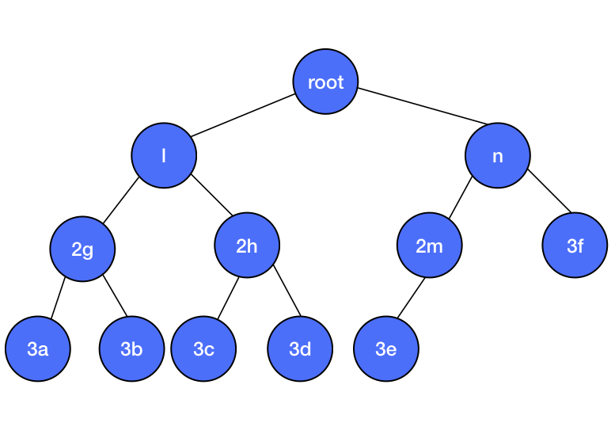

### 二叉树（Binary Tree）
二叉树是一种特殊的树结构，每个节点最多只有两个节点，左子节点和右子节点：

可以使用`Swift`的枚举实现二叉树：

```Swift
public indirect enum BinaryTree<T> {
    case node(BinaryTree<T>, T, BinaryTree<T>)
    case empty
}
```
有下面的节点构成一个二叉树结构：

```Swift
// 叶节点
let node1 = BinaryTree.node(.empty, "3a", .empty)
let node2 = BinaryTree.node(.empty, "3b", .empty)
let node3 = BinaryTree.node(.empty, "3c", .empty)
let node4 = BinaryTree.node(.empty, "3d", .empty)
let node5 = BinaryTree.node(.empty, "3e", .empty)
let node6 = BinaryTree.node(.empty, "3f", .empty)

// 第三层
let nodea = BinaryTree.node(node1, "2g", node2)
let nodeb = BinaryTree.node(node3, "2h", node4)
let nodec = BinaryTree.node(node5, "2m", .empty)

// 第二层
let left = BinaryTree.node(nodea, "l", nodeb)
let right = BinaryTree.node(node6, "n", nodec)

// 根节点
let root = BinaryTree.node(left, "root", right)
```


```Swift
extension BinaryTree: CustomStringConvertible {
    public var description: String {
        switch self {
        case let .node(left, value, right):
            return "value: \(value), left: [\(left.description)], right: [\(right.description)]"
        case .empty:
            return ""
        }
    }
}
```

打印出二叉树的结构：

```
value: root, left: [value: l, left: [value: 2g, left: [value: 3a, left: [], right: []], right: [value: 3b, left: [], right: []]], right: [value: 2h, left: [value: 3c, left: [], right: []], right: [value: 3d, left: [], right: []]]], right: [value: n, left: [value: 3f, left: [], right: []], right: [value: 2m, left: [value: 3e, left: [], right: []], right: []]]
```


根据每个节点是否存在左右子节点计算出总的节点数量：

```Swift
extension BinaryTree {
    var count: Int {
        switch self {
        case let .node(left, _, right):
            return left.count + 1 + right.count
        case .empty:
            return 0
        }
    }
}

print(root.count) // count is 12
```
### 遍历算法
根据当前节点和子节点的便利顺序不同可以分成三种遍历算法，

* 中序遍历
* 前序遍历
* 后序遍历

#### 中序遍历
遍历顺序：对当前节点的左子节点进行中序遍历 –> 当前节点 –> 对当前节点的右子节点进行中序遍历.

```Swift
extension BinaryTree {
    func traverseInOrder(process: (T) -> Void) {
        if case let .node(left, value, right) = self {
            left.traverseInOrder(process: process)
            process(value)
            right.traverseInOrder(process: process)
        }
    }
}
```
 
 
```Swift
root.traverseInOrder { (value) in
    print(value)
}

// result
3a
2g
3b
l
3c
2h
3d
root
3f
n
3e
2m
```

#### 前序遍历
遍历顺序：当前节点 –> 对当前节点的左子节点进行前序遍历 –> 对当前节点的右子节点进行前序遍历。

```Swift
public func traversePreOrder(process: (T) -> Void) {
    if case let .node(left, value, right) = self {
        process(value)
        left.traversePreOrder(process: process)
        right.traversePreOrder(process: process)
    }
}
```

#### 后序遍历
遍历顺序：对当前节点的左子节点进行后序遍历 –> 对当前节点的右子节点进行后序遍历 –> 当前节点。

```Swift
public func traversePostOrder(process: (T) -> Void) {
    if case let .node(left, value, right) = self {
        left.traversePostOrder(process: process)
        right.traversePostOrder(process: process)
        process(value)
    }
}
```