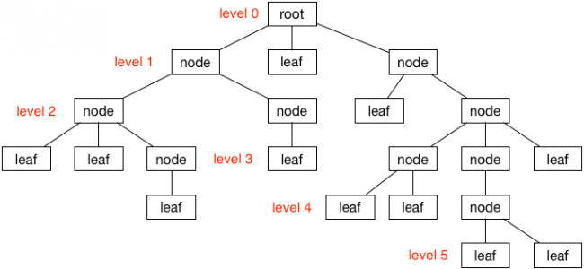

### 树（Tree）

🌲是由节点构成，通常一个数的结构有父节点和子节点，在节点中存储数据。最顶层的节点称为根节点，除了根节点外，每个子节点都有唯一个父节点。没有子节点的节点称为叶节点，也是最底层的节点。


### TreeNode
以下是简单实现`TreeNode`：

```Swift
public class TreeNode<T> {
    public var value: T
    
    public weak var parent: TreeNode?
    public var children = [TreeNode<T>]()
    
    init(value: T) {
        self.value = value
    }
    
    public func addChild(_ node: TreeNode<T>) {
        children.append(node)
        node.parent = self
    }
}
```

* `value`：存储当前节点数据数据
* `parent`：指定父节点
* `children`：存储所有的子节点
* `addChild`：添加子节点

```Swift
extension TreeNode: CustomStringConvertible {
    public var description: String {
        var s = "\(value)"
        if !children.isEmpty {
            s += "{" + children.map { $0.description }.joined(separator: ", ") + "}"
        }
        return s
    }
}
```

通过实现`CustomStringConvertible`协议的`description`属性查看树结构。

```Swift
extension TreeNode where T: Equatable {
    func search(_ value: T) -> TreeNode? {
        if value == self.value {
            return self
        }
        
        for child in children {
            if let result = child.search(value) {
                return result
            }
        }
        
        return nil
    }
}
```

通过`search`方法搜索树


