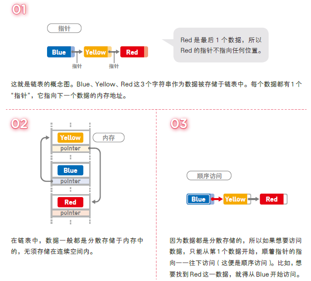
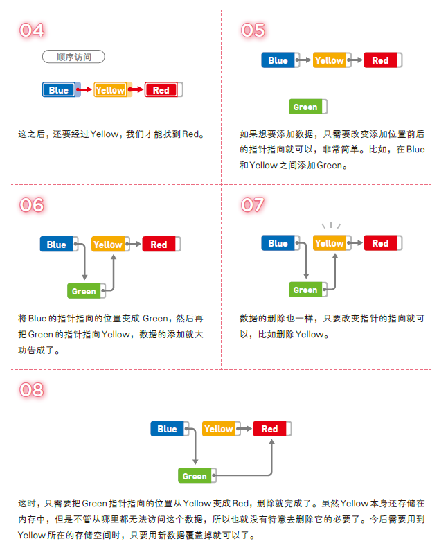

### 链表

数据呈线性排列，在链表中，数据添加和删除比较方便，但是访问比较耗时。





解说
对链表的操作所需的运行时间到底是多少呢？在这里，我们把链表中的数据量记成n。访问数据时，我们需要从链表头部开始查找（线性查找），如果目标数据在链表最后的话，需要的时间就是 O(n)。

另外，添加数据只需要更改两个指针的指向，所以耗费的时间与 n 无关。如果已经到达了添加数据的位置，那么添加操作只需花费 O(1) 的时间。删除数据同样也只需 O(1) 的时间。

#### 单向链表
单向链表的节点存储了下一个节点的地址。如下图：

    +--------+    +--------+    +--------+    +--------+
    |        |    |        |    |        |    |        |
    | node 0 |--->| node 1 |--->| node 2 |--->| node 3 |
    |        |    |        |    |        |    |        |
    +--------+    +--------+    +--------+    +--------+
    
#### 双向链表
双向链表的节点存储了上一个和下一个节点的地址。如下图：
    
    +--------+    +--------+    +--------+    +--------+
    |        |--->|        |--->|        |--->|        |
    | node 0 |    | node 1 |    | node 2 |    | node 3 |
    |        |<---|        |<---|        |<---|        |
    +--------+    +--------+    +--------+    +--------+
    
使用这种链表，不仅可以从前往后，还可以从后往前遍历数据，十分方便。
双向链表存在两个缺点：

* 指针数的增加会导致存储空间需求增加；
* 添加和删除数据时需要改变更多指针的指向。


#### 环形链表
环形链表也叫循环链表，单向链表在尾部没有指针，环形链表在链表尾部使用指针指向链表头部的数据，将链表变成环形。循环链表没有头和尾的概念，**想要保存数量固定的最新数据时通常会使用这种链表**。


          +--------+    +--------+    +--------+    
          |        |    |        |    |        |    
     ---->| node 0 |--->| node 1 |--->| node 2 |-----
     |    |        |    |        |    |        |    |
     |    +--------+    +--------+    +--------+    |  
     ------------------------<-----------------------                                                    

```Swift
final class LinkedListNode<T> {
    var value: T
    var next: LinkedListNode?
    init(value: T, next: LinkedListNode? = nil) {
        self.value = value
        self.next = next
    }
}
extension LinkedListNode: CustomStringConvertible {
    var description: String {
        guard let next = next else { return "\(value)" }
        return "\(value) -> \(String(describing: next))"
    }
} 
```

```Swift
struct LinkedList<T> {
    var head: LinkedListNode<T>?
    var tail: LinkedListNode<T>?
    init() { }
}

extension LinkedList: CustomStringConvertible {
    var description: String {
        guard let head = head else { return "Empty list" }
        return String(describing: head)
    }
}

extension LinkedList {
    var isEmpty: Bool {
        return head == nil
    }
}
```

```Swift
extension LinkedList {
    mutating func append(_ value: T) {
        guard !isEmpty else {
            let node = LinkedListNode(value: value)
            head = node
            tail = node
            return
        }
        let next = LinkedListNode(value: value)
        tail?.next = next
        tail = next
    }
    
    mutating func insert(_ value: T, after node: LinkedListNode<T>) {
        guard tail !== node else { append(value); return }
        node.next = LinkedListNode(value: value, next: node.next)
    }
}
```

```Swift
extension LinkedList {
    mutating func removeLast() -> T? {
        guard let head = head else { return nil }
        
        guard head.next != nil else {
            let headValue = head.value
            self.head = nil
            self.tail = nil
            return headValue
        }
        
        var prev = head
        var current = head
        
        while let next = current.next {
            prev = current
            current = next
        }
        
        prev.next = nil
        tail = prev
        return current.value
    }
    
    mutating func remove(after node: LinkedListNode<T>) -> T? {
        defer {
            if node.next === tail {
                tail = node
            }
            node.next = node.next?.next
        }
        return node.next?.value
    }
}

```
`remove(after:)：defer`里面的代码会在`return`语句执行之后运行，所以在`return node.next?.value`之后，判断`node`的下一个元素是否是最后一个元素，如果是，最后一个元素就变成了`node`；因为我们删除了`node`的下一个元素，所以`node.next`变成了`node.next?.next`。

```Swift
extension LinkedList {
    func node(at index: Int) -> LinkedListNode<T>? {
        var currentNode = head
        var currentIndex = 0
        
        while currentNode != nil && currentIndex < index {
            currentNode = currentNode?.next
            currentIndex += 1
        }
        
        return currentNode
    }
}
```

| 方法名 | 方法概述 | 时间复杂度 |
| --- | --- | --- |
| `append()` | 在最后面添加元素 | O(1) |
| `insert(after:)` | 在某个节点后面添加元素 | O(1) |
| `removeLast()` | 移除最后一个元素 | O(n) |
| `remove(after:)` | 移除某一节点后面的一个元素 | O(1) |
| `node(at:)` | 查找某个`index`对应的元素 | O(i) |

实现`Swift`的`Collection`协议
为什么要实现`Collection`协议？首先链表能存储了一系列的元素，实现`Sequence`协议是很合理的；并且链表的元素是有限的，这也非常符合`Collection`协议的要求。实现`Collection`协议之后，我们能使用`for-in`循环，能得到很多方便使用的方法。因为`Collection`继承于`Sequence`，所以我们实现`Collection`即可。`Sequence`和`Collection`这两个协议，大家可以看看官方文档去理解一下。

我们在苹果的文档中可以看到，实现`Collection`协议需要提供：

1.`startIndex`和`endIndex`属性；
2.下标的实现；
3.`index(after:)`的实现。

另外还要求访问`startIndex`和`endIndex`属性、通过下标访问元素的时间复杂度为O(1)。但是在链表里面，通过`index`去访问元素的时间复杂度是O(i)，无法满足`Collection`协议的要求。所以我们自定义了一个`Index`类型来存储对应的`Node`，这样就可以满足`Collection`协议的要求。

```Swift
extension LinkedList: Collection {

    struct Index: Comparable {
        var node: LinkedListNode<T>?

        static func ==(lhs: Index, rhs: Index) -> Bool {
            switch (lhs.node, rhs.node) {
            case let (left?, right?):
                return left.next === right.next
            case (nil, nil):
                return true
            default:
                return false
            }
        }

        static func <(lhs: Index, rhs: Index) -> Bool {
            guard lhs != rhs else { return false }
            let nodes = sequence(first: lhs.node) { $0?.next }
            return nodes.contains { $0 === rhs.node }
        }
    }

    var startIndex: Index {
        return Index(node: head)
    }

    var endIndex: Index {
        return Index(node: tail?.next)
    }

    func index(after i: Index) -> Index {
        return Index(node: i.node?.next)
    }

    subscript(index: Index) -> T {
        return index.node!.value
    }
}
```
#### 把`LinkedList`变成值类型
```Swift
extension LinkedList {
    private mutating func copyNodes() {
        guard !isKnownUniquelyReferenced(&head) else { return }
        guard var oldNode = head else { return }
        
        head = LinkedListNode(value: oldNode.value)
        var newNode = head
        
        while let nextOldNode = oldNode.next {
            let nextNewNode = LinkedListNode(value: nextOldNode.value)
            newNode?.next = nextNewNode
            newNode = nextNewNode
            oldNode = nextOldNode
        }
        
        tail = newNode
    }
}
```
这个方法对所有链表的节点进行了复制。其中`guard !isKnownUniquelyReferenced(&head) else { return }`是用来判断当前的链表是否只被一个变量引用，如果是，则无需复制；否则会继续执行，对所有节点进行复制。

把`copyNodes()`方法添加到所有改变链表元素的方法最上面，方法包括：`append()`、`insert(after:)`、`removeLast()`和`remove(after:)`。例如：
```Swift
mutating func append(_ value: T) {
    copyNodes()

    guard !isEmpty else {
        let node = LinkedListNode(value: value)
        head = node
        tail = node
        return
    }
    let next = LinkedListNode(value: value)
    tail?.next = next
    tail = next
}
```

```Swift
var list1 = LinkedList<Int>()
list1.append(1)
list1.append(2)
list1.append(3)

let list2 = list1

print("list1: \(list1)")
print("list2: \(list2)")

print("========分割线========")

list1.append(4)

print("list1: \(list1)")
print("list2: \(list2)")

// 结果
list1: 1 -> 2 -> 3  
list2: 1 -> 2 -> 3  
========分割线========
list1: 1 -> 2 -> 3 -> 4   
list2: 1 -> 2 -> 3 
```

1.[我的第一本算法书](http://www.ituring.com.cn/book/tupubarticle/23941)
2.[【数据结构与算法 – Swift实现】02 – 链表](http://zengwenzhi.com/2018/06/12/%E3%80%90%E6%95%B0%E6%8D%AE%E7%BB%93%E6%9E%84%E4%B8%8E%E7%AE%97%E6%B3%95-swift%E5%AE%9E%E7%8E%B0%E3%80%9102-%E9%93%BE%E8%A1%A8/)
